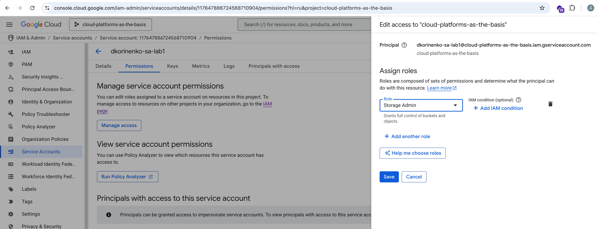
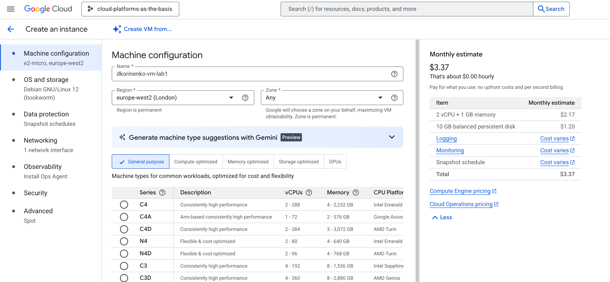
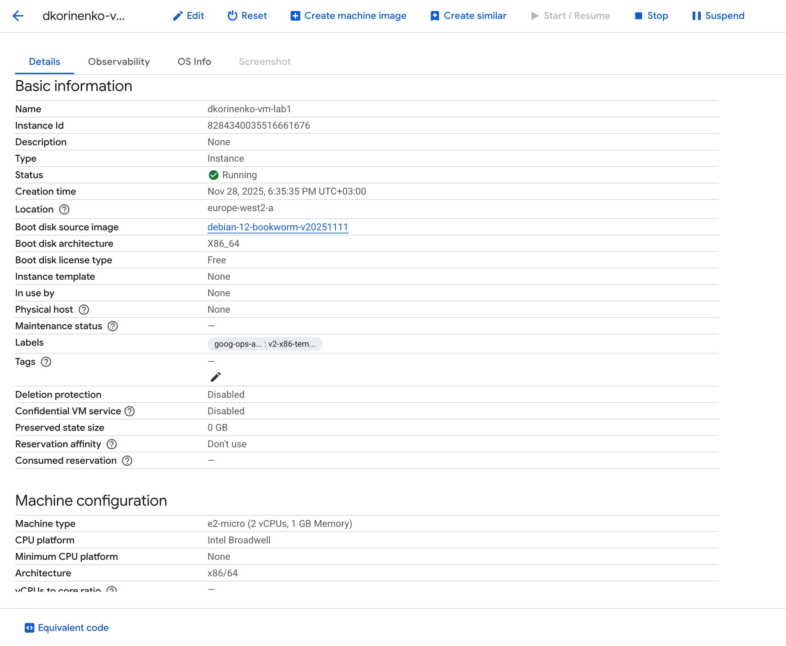
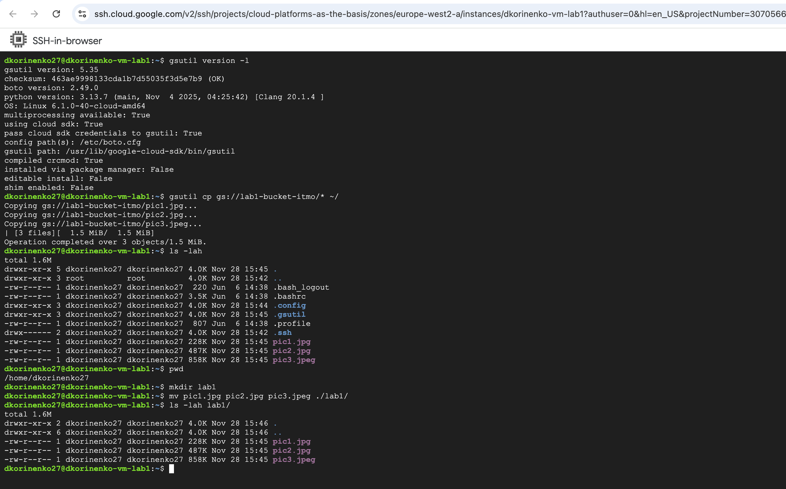
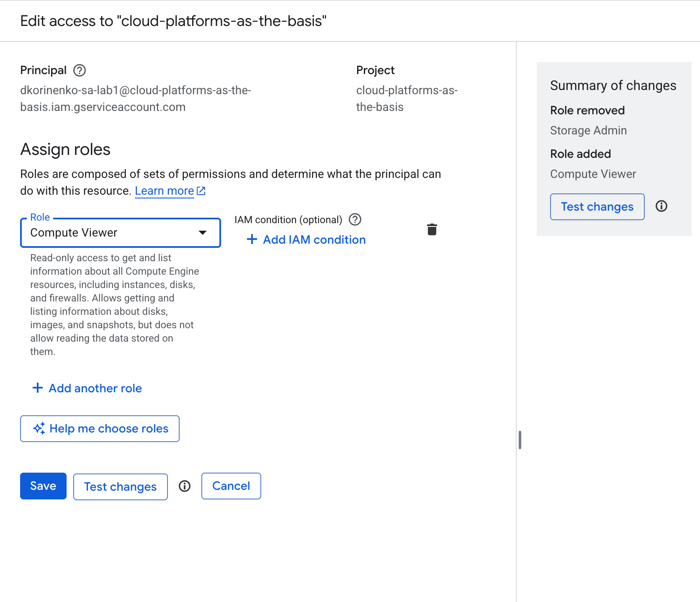
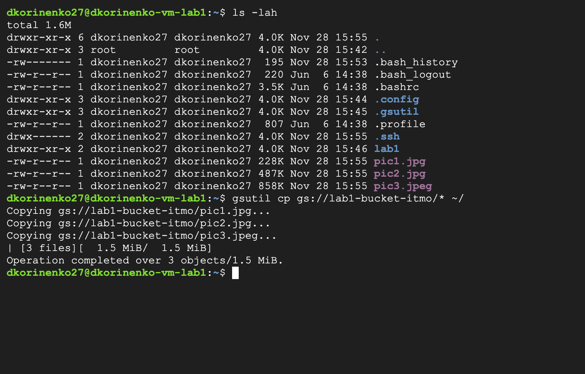
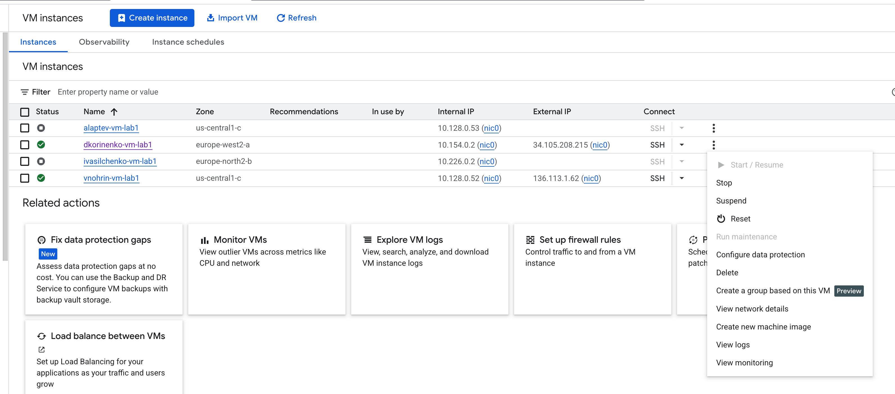

University: [ITMO University](https://itmo.ru/ru/) \
Faculty: [FICT](https://fict.itmo.ru) \
Course: [Cloud platforms as the basis of technology entrepreneurship](https://itmo-ict-faculty.github.io/cloud-platforms-as-the-basis-of-technology-entrepreneurship/) \
Year: 2025/2026 \
Group: U4225 \
Author: Korinenko Daniil Trofimovich \
Lab: Lab1 \
Date of create: 28.11.2025 \
Date of finished: \

## Ход работы
1. Service Account с ролью Storage Admin 

2. Создание виртуальной машины: 

3. Данные о машине: 

4. Копирование файлов и добавление их в папку: 

5. Изменение роли на `Compute Viewer`: 

6. После изменения роли SA как будто ничего не поменялось, потому что так же получилось скопировать файлы. Возможно, дело в том, что сервис аккаунт не был привязан каким-то образом к VM 

7. Удаляем созданную VM: 