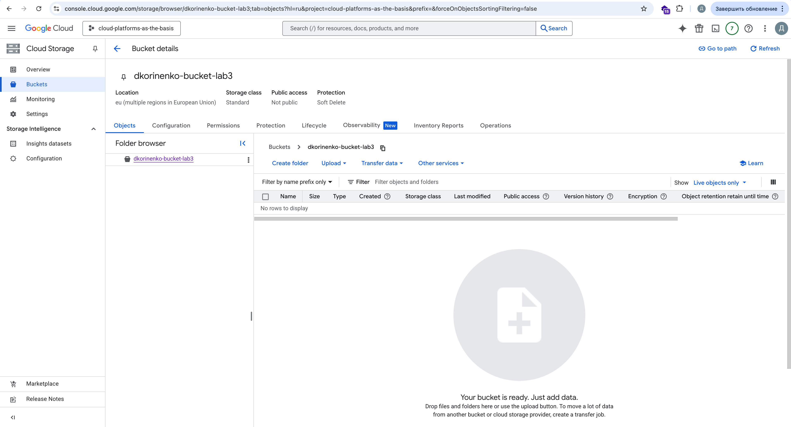
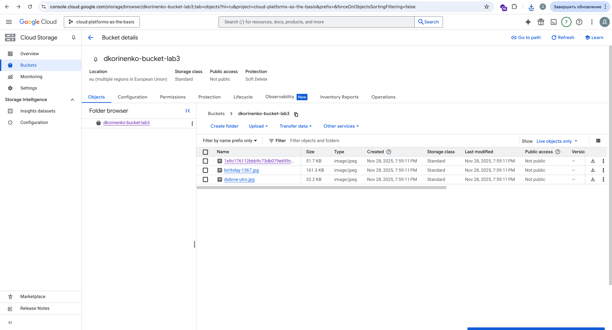
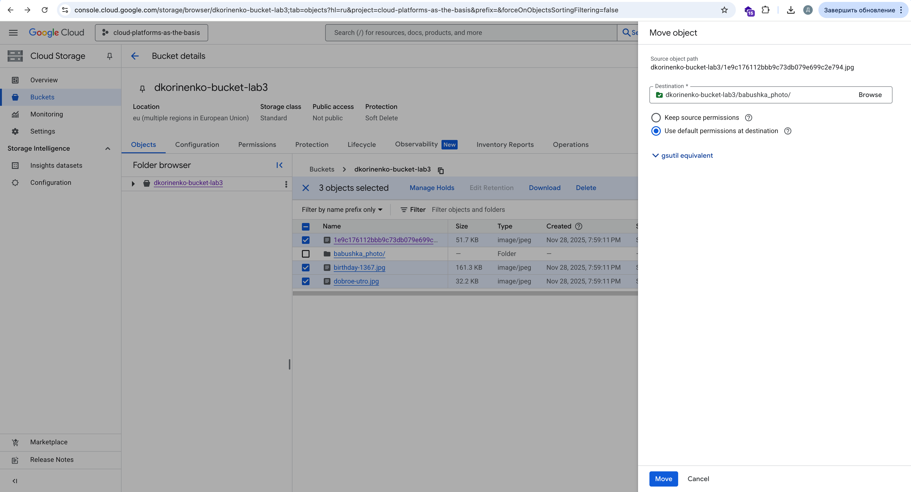
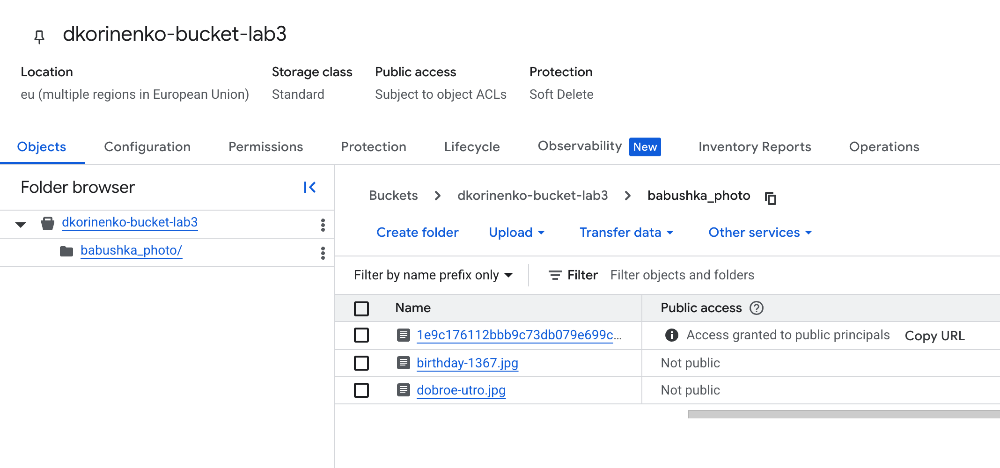
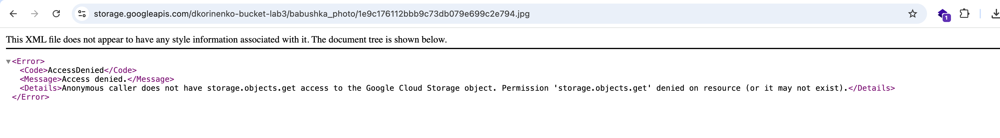
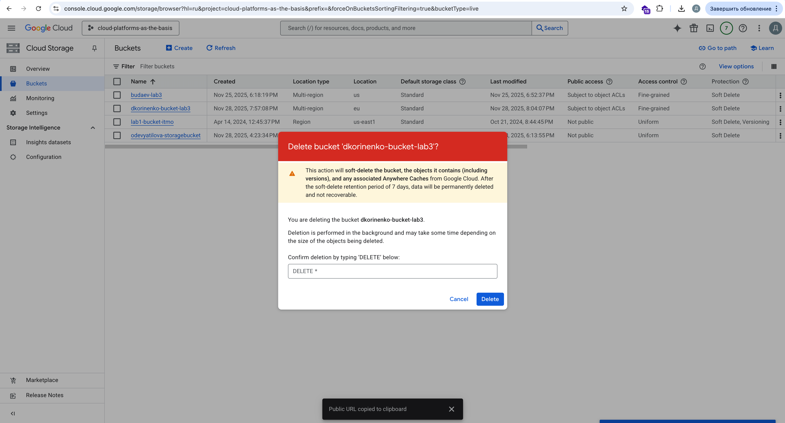

University: [ITMO University](https://itmo.ru/ru/) \
Faculty: [FICT](https://fict.itmo.ru) \
Course: [Cloud platforms as the basis of technology entrepreneurship](https://itmo-ict-faculty.github.io/cloud-platforms-as-the-basis-of-technology-entrepreneurship/) \
Year: 2025/2026 \
Group: U4225 \
Author: Korinenko Daniil Trofimovich \
Lab: Lab2 \
Date of create: 28.11.2025 \
Date of finished: 28.11.2025 \

## Ход работы
1. Создали бакет 

2. Загрузили файлы 

3. Добавили файлы в папку 

4. Изменили доступ к файлам   

5. Удалили бакет 