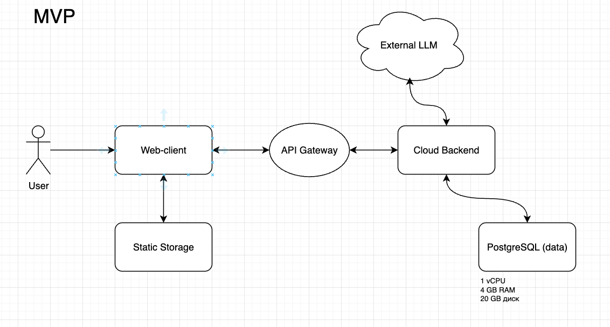
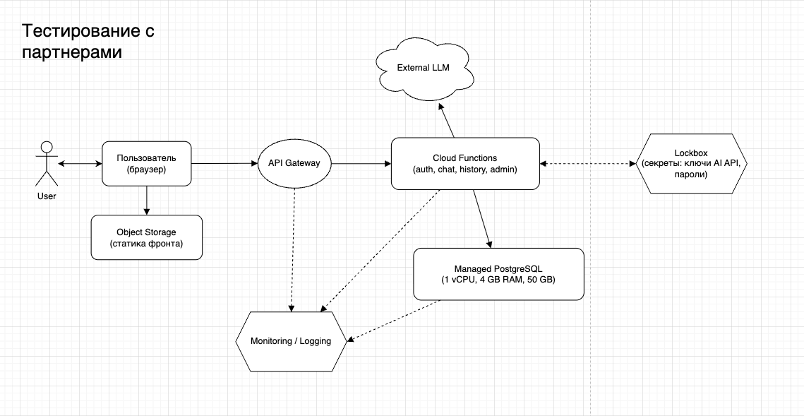
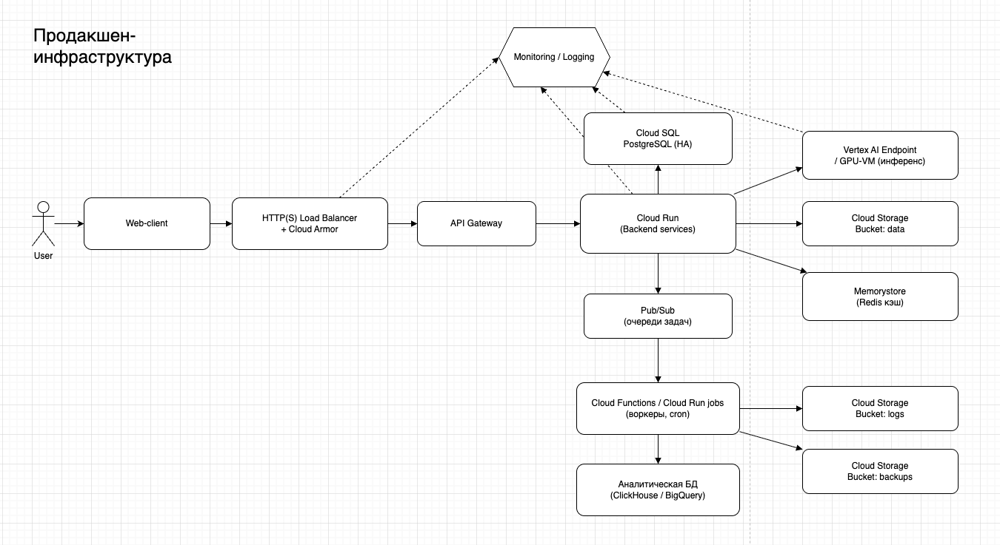

University: [ITMO University](https://itmo.ru/ru/) \
Faculty: [FICT](https://fict.itmo.ru) \
Course: [Cloud platforms as the basis of technology entrepreneurship](https://itmo-ict-faculty.github.io/cloud-platforms-as-the-basis-of-technology-entrepreneurship/) \
Year: 2025/2026 \
Group: U4225 \
Author: Korinenko Daniil Trofimovich \
Lab: Lab1 \
Date of create: 01.12.2025\
Date of finished: 01.12.2025

# Ход работы

## Оценка количества пользователей
| Этап                   | Активных пользователей | Запросов к API в месяц |
|------------------------|------------------------|------------------------|
| Этап 1 – MVP           | ~10                    | ~6 000                 |
| Этап 2 – Партнёры      | ~100                   | ~60 000                |
| Этап 3 – Прод          | ~1 000                 | ~600 000               |

## Шаг 1 — MVP
### Верхнеуровневая схема
Быстрый прототип для проверки потребности. Небольшое количество внутренних пользователей (команда), проверка гипотез и базовой работоспособности AI-сервиса. Примерно ~10 активных пользователей, ~6 000 запросов в месяц.

### Оценка
| Компонент       | Стоимость в месяц (≈, ₽) |
|-----------------|--------------------------:|
| PostgreSQL      | ~2 700 ₽                  |
| Object Storage  | ~20 ₽                     |
| Cloud Functions | ~0 ₽                      |
| API Gateway     | ~0 ₽                      |
| **Итого**       | **≈ 2 700 ₽/мес**         |

## Шаг 2 — Тестирование с партнерами
### Верхнеуровневая схема
Сохраняем простую serverless-архитектуру, но добавляем безопасность и наблюдаемость: секреты, метрики, алерты. Нам очень важно видеть, как пользователи взаимодействуют с продуктом и видеть аналитику

### Оценка
| Компонент                 | Стоимость в месяц (≈, ₽) |
|---------------------------|--------------------------:|
| PostgreSQL                | ~2 800 ₽                  |
| Object Storage            | ~20 ₽                     |
| Cloud Functions           | ~0 ₽                      |
| API Gateway               | ~0 ₽                      |
| Lockbox + Monitoring/Logs | ~200 ₽                    |
| **Итого**                 | **≈ 3 000 ₽/мес**         |

## Шаг 3 — Продакшен-инфраструктура
### Верхнеуровневая схема

### Оценка
| Компонент                                         | Стоимость в месяц |
|--------------------------------------------------|--------------------------:|
| HTTP(S) Load Balancer + Cloud Armor              | 3 900 ₽                   |
| API Gateway                                      | 11 700 ₽                  |
| Cloud Run (несколько сервисов, автоскейл)       | 19 600 ₽                  |
| Cloud SQL for PostgreSQL (HA-инстанс)           | 15 600 ₽                  |
| Redis (Memorystore)                              | 23 500 ₽                  |
| Vertex AI Endpoint / GPU-VM                      | 15 600 ₽                  |
| Cloud Storage + Cloud CDN (data/logs/backups)    | 6 300 ₽                   |
| Pub/Sub (очереди задач)                          | 1 600 ₽                   |
| Cloud Functions / Cloud Run jobs (cron/воркеры)  | 1 600 ₽                   |
| Аналитическая БД (ClickHouse / BigQuery и т.п.) | 9 400 ₽                   |
| Cloud Logging + Monitoring + Alerts              | 6 300 ₽                   |
| VPC, firewall, service accounts                  | 0 ₽                       |
| Резерв на сетевой трафик / egress                | 7 800 ₽                   |
| **Итого**                                        | **≈ 122 900 ₽ (~123k)**   |

## Заключение
Шаг 1 – MVP: ≈ 2 700 ₽/мес
Практически все расходы — это управляемая PostgreSQL. Такой уровень расходов позволяет безболезненно валидировать гипотезы.

Шаг 2 – Партнёры: ≈ 3 000 ₽/мес
Добавление Lockbox и Monitoring/Logs повышает комфорт эксплуатации и безопасность практически без роста бюджета: +300 ₽ к месячной стоимости при десятикратном росте числа пользователей и запросов.

Шаг 3 – Прод: ≈ 123 000 ₽/мес
Здесь появляется качественно другой профиль расходов:
- несколько десятков тысяч на вычислительные сервисы (Cloud Run, Redis, Cloud SQL, Vertex AI),
- ощутимая доля на сетевые компоненты, CDN и логи,
- отдельные деньги на аналитику.